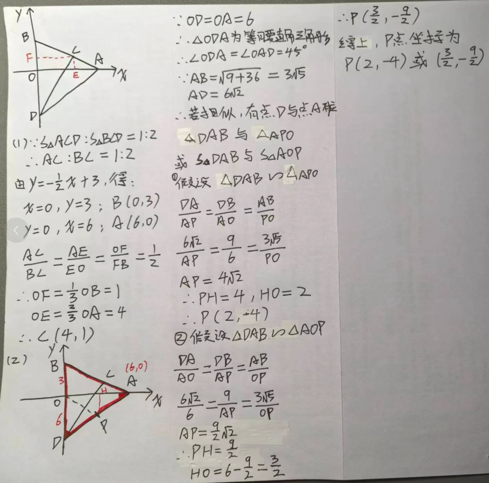
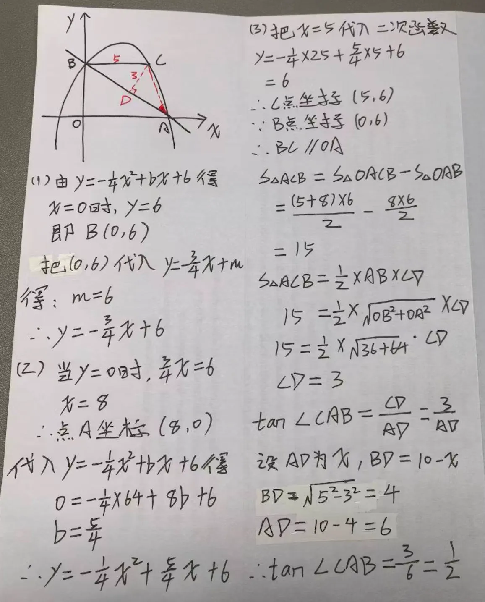
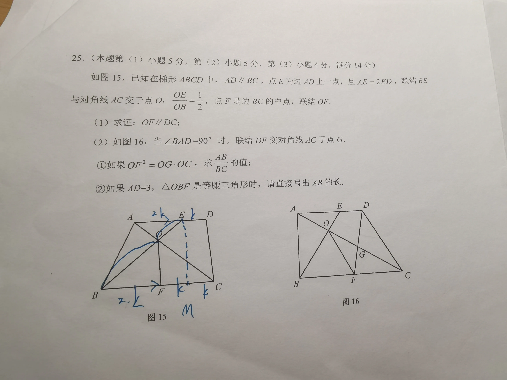
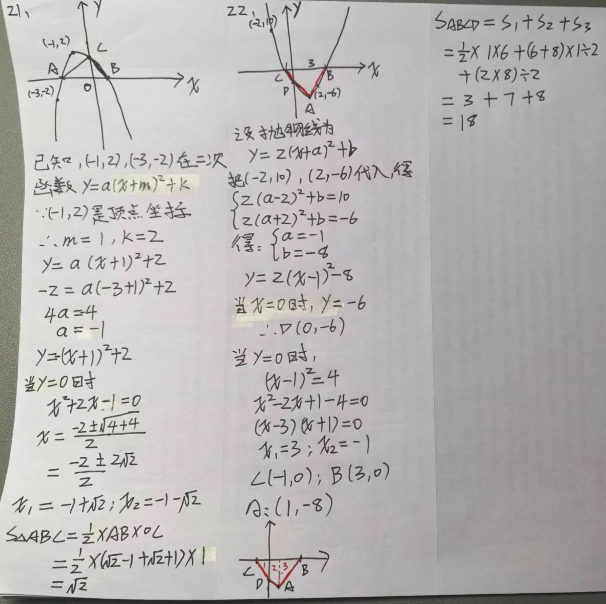
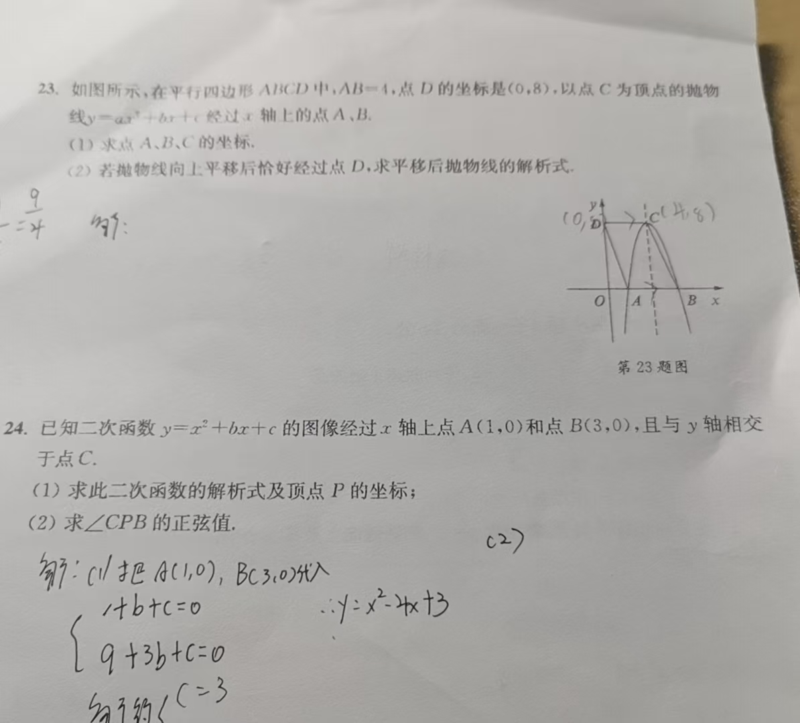

# 汤梓烨 20251026

## 上课链接

-   教研杜老师邀请你参加会议
-   会议主题：试听
-   会议时间：2025/10/26 15:30-16:00
-   会议链接：https://work.weixin.qq.com/webapp/tm/2H4dIRFoNKh
-   733 196 057

## 上课内容

### <mark>1、相似三角形

-   题目：
    
-   考点：
    -   相似三角形
-   解析：
    

### <mark>2、相似三角形

-   题目：
    
-   考点：反比例函数，相似三角形
-   解析：
    

### <mark>3、相似三角形

-   题目：
-   考点：相似三角形
-   解析：

### 第四题

-   题目
    
-   考点：相似三角形

### <mark>5、二次函数

-   题目
    
-   考点
    -   二次函数
-   解析
    

### 第六题

-   题目
    
-   考点
    -   二次函数
-   解析

### <mark>7、二次函数

-   题目：
    
-   考点：
    -   一次函数
    -   二次函数
    -   锐角三角比 tan
-   解析：
    
